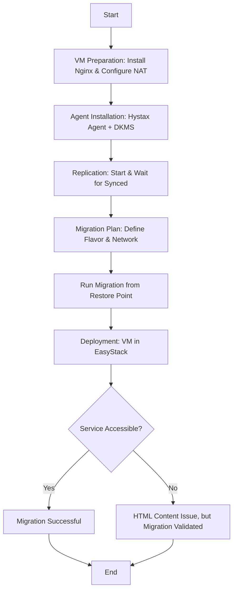

# Oracle VirtualBox to EasyStack via Hystax
[](#)
[](#)
[](https://creativecommons.org/licenses/by/4.0/)

📄 [Glossary](GLOSSARY.md) 
🌐 [Visit My HTML](web-asg-file.html)  

## i. Introduction
This document provides technical documentation of the migration process from an **Oracle VirtualBox virtual machine** to an **EasyStack environment** using **Hystax**.  

The purpose of this migration was to validate the feasibility of replicating workloads from a local virtualization environment to a cloud-based infrastructure while preserving functionality.  

The test workload involved deploying and serving a static web page through **Nginx**, which served as a baseline service to confirm successful replication.  

The report captures the steps required to configure the environment, prepare the system for migration, and execute replication through the Hystax platform.

---

## ii. Methodology

The migration was conducted in three primary phases:

1. **Virtual Machine Preparation**  
   - Configured VM in Oracle VirtualBox.  
   - Installed and tested Nginx for service delivery.  
   - Resolved networking via NAT and port forwarding.  

2. **System Preparation for Replication**  
   - Verified Linux kernel version.  
   - Installed kernel headers, DKMS, and build tools.  
   - Installed the Hystax replication agent.  

3. **Replication and Migration via Hystax**  
   - Initiated replication in Hystax Management Console.  
   - Created migration plan.  
   - Deployed migrated VM in EasyStack environment.  

---

## 1. Initial Setup on Oracle VirtualBox

### 1.1 Nginx Installation & Configuration
```bash
# Update package list
sudo apt update
# Install Nginx
sudo apt install nginx -y
# Start and enable Nginx
sudo systemctl start nginx
sudo systemctl enable nginx
# Verify Nginx status
sudo systemctl status nginx
````

Retrieve VM IP:

```bash
ip a
```

Returned: `inet 10.0.2.15/24`.
Direct access failed due to NAT configuration.

---

### 1.2 Network Adjustment with NAT and Port Forwarding

VirtualBox → **Settings → Network → NAT → Port Forwarding**

| Host IP   | Host Port | Guest IP  | Guest Port |
| --------- | --------- | --------- | ---------- |
| 127.0.0.1 | 8080      | 10.0.2.15 | 80         |

Accessed successfully at:

```
http://127.0.0.1:8080
```

---

### 1.3 Uploading HTML Content

```bash
sudo cp /media/sf_file/web-asg-file.html /var/www/html/
sudo chown www-data:www-data /var/www/html/web-asg-file.html
```

Verified at:

```
http://127.0.0.1:8080/web-asg-file.html
```

---

## 2. Migration via Hystax

### 2.1 Download Agents

Steps performed in **Hystax Management Console**:

1. **Customer Creation** → Created new account under my name.

2. **Customer Selection** → Selected newly created account.

3. **Agent Type** → Chose **Internal Agent (Linux)**.

4. **Agent Settings** → Configured machine identification, network subnet, and IP mapping.

5. **Kernel Compatibility**

   ```bash
   uname -r
   ```

   Result: `6.8.0-71-generic` → Required DKMS since prebuilt module unavailable.

6. **Replication Instructions** → Installed DKMS, headers, and dependencies.

   ```bash
   sudo apt-get update && sudo apt-get install dkms perl make gcc libelf-dev \
   linux-headers-$(uname -r) linux-headers-generic
   sudo dpkg -i hlragent.deb
   ```

---

### 2.2 Replication and Migration Execution

1. In **Machines tab** → Waited until VM detected → Started replication.

   * Status progressed to **Synced**.

2. In **Migration Plans tab** → Created migration plan with configuration below:

| Parameter         | Value                                 |
| ----------------- | ------------------------------------- |
| **Flavor**        | 2C-4G (2 vCPU, 4 GB RAM)              |
| **Port Name**     | port\_0                               |
| **Port Subnet**   | ACME\_network\_default\_ipv4\_subnet  |
| **Port IP**       | 10.0.2.15 (NAT IP in VirtualBox)      |
| **Target Subnet** | ACME\_network\_default\_ipv4\_subnet  |
| **Subnet ID**     | fbe19c26-08f5-493a-8dd1-eaa888f9f12a  |
| **Target CIDR**   | 10.10.10.0/24 (EasyStack destination) |

3. **Run Migration** → Selected latest restore point → Executed migration.
4. Migrated VM appeared under **OpenStack Instances**.

---

## 3. Conclusion

This migration demonstrated the complete workflow of moving a workload from Oracle VirtualBox to EasyStack using Hystax.

Key steps included:

* Preparing the web server.
* Configuring NAT and port forwarding.
* Verifying application delivery via Nginx.
* Setting up the Linux kernel for replication.

The migration process was completed successfully, with the VM appearing as an instance in EasyStack.

⚠️ The custom HTML file did not replicate due to an environment-specific baremetal error. However, since the **primary objective was to validate the migration procedure itself**, the task was achieved as planned.

### License
This documentation is released under the Creative Commons Attribution 4.0 International (CC BY 4.0) license. You are free to share and adapt the material for any purpose, provided that appropriate credit is given.
